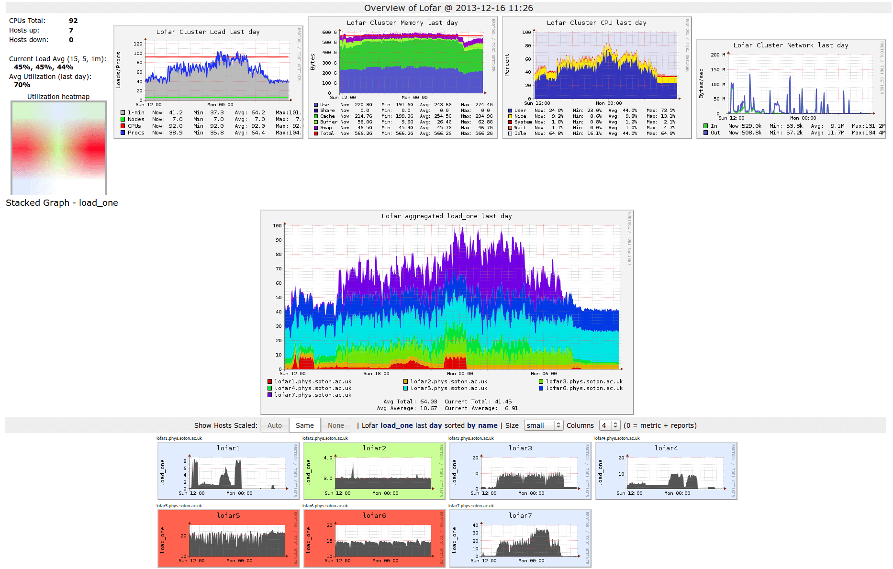

  - [Introduction](#introduction)
      - [Before You Start](#before-you-start)
      - [Goal of this Lab](#goal-of-this-lab)
  - [Guide](#guide)
      - [The GDELT project](#the-gdelt-project)
      - [Docker](#docker)
          - [Setting up Spark in Docker](#setting-up-spark-in-docker)
      - [Scala](#scala)
      - [Apache Spark](#apache-spark)
          - [Resilient Distributed Datasets](#resilient-distributed-datasets)
          - [Dataframe and Dataset](#dataframe-and-dataset)
          - [Packaging your application using SBT](#packaging-your-application-using-sbt)
  - [Lab 1](#lab-1)
      - [Before you start](#before-you-start-1)
      - [Assignment](#assignment)
      - [Deliverables](#deliverables)
      - [Questions](#questions)
  - [Lab 2](#lab-2)
      - [Amazon Web Services](#amazon-web-services)
      - [Assignment](#assignment-1)
      - [Deliverables](#deliverables-1)
  - [Lab 3](#lab-3)
      - [Setting up](#setting-up)
      - [Assignment](#assignment-2)
      - [Deliverables](#deliverables-2)
      - [Questions](#questions-1)
          - [General Kafka questions](#general-kafka-questions)
          - [Questions specific to the assignment](#questions-specific-to-the-assignment)

# Introduction

In this lab we will put the concepts that are central to Supercomputing with
Big Data in some practical context. We will analyze a large open data set and
identify a way of processing it efficiently using [Apache Spark](https://spark.apache.org) and the
[Amazon Web Services](https://aws.amazon.com) (AWS). The data set in question is the [GDELT 2.0 Global
Knowledge Graph](https://blog.gdeltproject.org/introducing-gkg-2-0-the-next-generation-of-the-gdelt-global-knowledge-graph/) (GKG), which indexes persons, organizations, companies,
locations, themes, and even emotions from live news reports in print, broadcast
and internet sources all over the world. We will use this data to construct a
histogram of the topics that are most popular on a given day, hopefully giving
us some interesting insights into the most important themes in recent history.

Feedback is appreciated\! The lab files will be hosted on [GitHub](https://github.com/Tclv/SBD-tudelft). You can
also find the most up-to-date version of this manual over there. Feel free to
make issues and/or pull requests to suggest or implement improvements.

## Before You Start

All assignments are completed in groups of two, so you and your prospective
team mate should enroll in a group via Brightspace.

Furthermore, the complete data set we will be looking at in lab 2 weighs in at
several terabytes, so we need some kind of compute and storage infrastructure
to run the pipeline. In this lab we will use Amazon AWS to facilitate this. As
a student you are eligible for credits on this platform. We would like you to
register for the [GitHub Student Developer Pack](https://education.github.com/pack), as soon as you decide to
take this course. This gives you access to around 100 dollars worth of credits.
This should be ample to complete lab 2. Don’t forget to follow to register on
AWS using the referral link from GitHub. Use the “AWS Account ID” option
(requiring a credit card), if you can.

**Make sure you register for these credits as soon as possible\! You can always
send an email to the TAs if you run into any trouble.**

Finally, be sure to keep an eye on the Brightspace page for course updates and
the tentative schedule and deadlines.

## Goal of this Lab

The goal of this lab is to:

  - familiarize yourself with Apache Spark, the MapReduce programming model,
    and Scala as a programming language;
  - learn how to characterize your big data problem analytically and
    practically and what machines best fit this profile;
  - get hands-on experience with cloud-based systems;
  - learn about the existing infrastructure for big data and the difficulties
    with these; and
  - learn how an existing application should be modified to function in a
    streaming data context.

You will work in groups of two. In this lab manual we will introduce a big data
pipeline for identifying important events from the GDELT Global Knowledge Graph
(GKG).

In lab 1, you will start by writing a Spark application that processes the
GDELT dataset. You will run this application on a small subset of data on
your local computer. You will use this to

1.  get familiar with the Spark APIs,
2.  analyze the application’s scaling behavior, and
3.  draw some conclusions on how to run it efficiently in the cloud.

It is up to you how you want to define *efficiently*, which can be in terms of
performance, cost, or a combination of the two.

You may have noticed that the first lab does not contain any supercomputing,
let alone big data. For lab 2, you will deploy your code on AWS, in an actual
big data cluster, in an effort to scale up your application to process the
complete dataset, which measures several terabytes. It is up to you to find the
configuration that will get you the most efficiency, as per your definition in
lab 1.

For the final lab, we will modify the code from lab 1 to work in a streaming
data context. You will attempt to rewrite the application to process events in
real-time, in a way that is still scalable over many machines.

# Guide

In this first chapter, we will cover some of the concepts and technologies that
are used during the course. We will introduce the following topics (in a
different order):

  - **The GDELT project**, a large database of “human society”, constructed of
    mentions of “people, organizations, locations, themes, counts, images and
    emotions” around the planet. As mentioned before, will use the GDELT
    database to construct a histogram of the most important themes during a
    certain timespan.
  - **Apache Spark**, a framework for processing large amounts of data on
    multiple machines in a robust way. We will build our application for labs 1
    and 2 using Spark.
  - **Amazon Web Services**, or AWS, which provide theoretically unlimited
    compute infrastructure, allowing us to process a dataset as large as the
    entire GDELT database in lab 2.
  - **Apache Kafka**, a framework for building so-called data pipelines, in
    which
    potentially many producers and consumers process real-time, streaming data.
    In lab 3, we will take the application from labs 1 and 2 and modify it to
    process data in real-time, using Kafka.
  - **Scala**, a programming language that runs on the Java Virtual Machine
    (JVM). This is our (mandatory\!) language of choice during the lab
    assignments. We will use it to program for both Apache Spark and Apache
    Kafka.
  - **Docker**, an application that allows the user to package and run software
    (like Spark and Kafka and the programs we write for them) in an isolated
    environment: a container.

## The GDELT project

During the lab, we will use the GDELT Global Knowledge Graph version 2.0 (GKG
v2.0). This database is basically a massive table that “connects every person,
organization, location, count, theme, news source, and event across the planet
into a single massive network that captures what’s happening around the world,
what its context is and who’s involved, and how the world is feeling about it,
every single day.”

The GKG is updated every 15 minutes and published as a series of compressed
comma-separated values (CSV) files (in which the columns are actually separated
using tabs). The first segment of the version 2 database was published back in
2015 and at the time of writing (September 2019) it contains 157378 segments
with a total compressed file size of 1.4 terabytes (TiB). Uncompressed, this
comes down to about 4.2 terabytes of raw data.

Read [this article](https://blog.gdeltproject.org/gdelt-2-0-our-global-world-in-realtime/) for a general introduction to the dataset, [this table](https://github.com/linwoodc3/gdelt2HeaderRows/blob/master/schema_csvs/GDELT_2.0_gdeltKnowledgeGraph_Column_Labels_Header_Row_Sep2016.tsv) for
a quick overview of its columns and what they mean, and [this document](http://data.gdeltproject.org/documentation/GDELT-Global_Knowledge_Graph_Codebook-V2.1.pdf) for a
more in depth description.

During the labs, we will use the `AllNames` column, which lists all “proper
names” (people, organizations, countries, etcetera) mentioned. It can be seen
as a summary of many of the other columns.

## Docker

According to the [Docker Documentation](https://docs.docker.com/get-started)

> Docker is a platform for developers and sysadmins to develop, deploy, and run
> applications with containers. The use of Linux containers to deploy
> applications is called containerization. Containers are not new, but their
> use for easily deploying applications is. Containerization is increasingly
> popular because containers are:
> 
>   - Flexible: Even the most complex applications can be containerized.
>   - Lightweight: Containers leverage and share the host kernel.
>   - Interchangeable: You can deploy updates and upgrades on-the-fly.
>   - Portable: You can build locally, deploy to the cloud, and run anywhere.
>   - Scalable: You can increase and automatically distribute container
>     replicas.
>   - Stackable: You can stack services vertically and on-the-fly.

For this course, we use Docker primarily to ensure every student is using the
exact same platform for their applications, and to avoid certain
platform-specific issues and peculiarities.

A basic understanding of some [Docker](https://docs.docker.com/) concepts helps in getting started with
this course. [Part 1: Orientation and setup](https://docs.docker.com/get-started/) of the [Get Started Guide](https://docs.docker.com/get-started/) covers the basic [Docker](https://docs.docker.com/) concepts used in this course.

Before trying the lab assignments and tutorials in the next sections, make sure
you [Install Docker (stable)](https://docs.docker.com/install/#supported-platforms) and test your installation by running the simple
[Hello World image](https://hub.docker.com/_/hello-world).

``` bash
docker run hello-world
```

### Setting up Spark in Docker

In order to run Spark in a container, a `Dockerfile` is provided which can be
used to build images for `spark-submit` to run your Spark application,
`spark-shell` to run a Spark interactive shell, and the Spark history server to
view event logs from application runs. You need to build these images before
you get started. The Dockerfiles we provide assume that you run Docker from the
folder at which they are located. Don’t move them around\! They will stop
working.

To build a docker image from the Dockerfile, we use `docker build`:

``` bash
docker build --target <target> -t <tag> .
```

Here `<target>` selects the target from the Dockerfile, `<tag>` sets the tag
for the resulting image, and the `.` sets the build context to the current
working directory.

We use `docker build` to build the images we need to use Spark and SBT.

  - `sbt`\[1\]
    
    ``` bash
    docker build \
    --build-arg BASE_IMAGE_TAG="8" \
    --build-arg SBT_VERSION="1.2.8" \
    --build-arg SCALA_VERSION="2.11.12" \
    -t hseeberger/scala-sbt \
    github.com/hseeberger/scala-sbt.git#:debian
    ```

  - `spark-shell`
    
    ``` bash
    docker build --target spark-shell -t spark-shell .
    ```

  - `spark-submit`
    
    ``` bash
    docker build --target spark-submit -t spark-submit .
    ```

  - `spark-history-server`
    
    ``` bash
    docker build --target spark-history-server -t spark-history-server .
    ```

You can then run the following commands from the Spark application root
(the folder containing the `build.sbt` file). Please make sure to use the
provided template project.

  - Run SBT to package or test your application (`sbt <command>`)
    
    ``` bash
    docker run -it --rm -v "`pwd`":/root hseeberger/scala-sbt sbt
    ```

  - Start a Spark shell (`spark-shell`)
    
    ``` bash
    docker run -it --rm -v "`pwd`":/io spark-shell
    ```

  - Run your Spark application (`spark-submit`) (fill in the class name of your
    application and the name of your project\!)
    
    ``` bash
    docker run -it --rm -v "`pwd`":/io -v "`pwd`"/spark-events:/spark-events \
    spark-submit --class <YOUR_CLASSNAME> \
    target/scala-2.11/<YOUR_PROJECT_NAME>_2.11-1.0.jar
    ```

  - Spawn the history server to view event logs, accessible at
    [localhost:18080](http://localhost:18080)
    
    ``` bash
    docker run -it --rm -v "`pwd`"/spark-events:/spark-events \
    -p 18080:18080 spark-history-server
    ```

The rest of the manual will not generally mention these Docker commands again,
so know that if we mention e.g. `spark-shell`, you should run the corresponding
`docker run` command listed above. You can create scripts or aliases for your
favorite shell to avoid having to type a lot.

## Scala

Apache Spark, our big data framework of choice for this lab, is implemented in
Scala, a compiled language on the JVM that supports a mix between functional
and object-oriented programming. It is compatible with Java libraries. Some
reasons why Spark was written in Scala are:

1.  Compiling to the JVM makes the codebase extremely portable and deploying
    applications as easy as sending the Java bytecode (typically packaged in a
    **J**ava **AR**chive format, or JAR). This simplifies deploying to cloud
    provider big data platforms as we don’t need specific knowledge of the
    operating system, or even the underlying architecture.

2.  Compared to Java, Scala has some advantages in supporting more complex
    types, type inference, and anonymous functions\[2\]. Matei
    Zaharia, Apache Spark’s original author, has said the following about why
    Spark was implemented in Scala in a [Reddit AMA](https://www.reddit.com/r/IAmA/comments/31bkue/im_matei_zaharia_creator_of_spark_and_cto_at/):
    
    > At the time we started, I really wanted a PL that supports a
    > language-integrated interface (where people write functions inline, etc),
    > because I thought that was the way people would want to program these
    > applications after seeing research systems that had it (specifically
    > Microsoft’s DryadLINQ). However, I also wanted to be on the JVM in order to
    > easily interact with the Hadoop filesystem and data formats for that. Scala
    > was the only somewhat popular JVM language then that offered this kind of
    > functional syntax and was also statically typed (letting us have some control
    > over performance), so we chose that. Today there might be an argument to make
    > the first version of the API in Java with Java 8, but we also benefitted from
    > other aspects of Scala in Spark, like type inference, pattern matching, actor
    > libraries, etc.

Apache Spark provides interfaces to Scala, R, Java and Python, but we will be
using Scala to program in this lab. An introduction to Scala can be found on
the [Scala language site](https://docs.scala-lang.org/tour/tour-of-scala.html). You can have a brief look at it, but you can also
pick up topics as you go through the lab.

## Apache Spark

Apache Spark provides a programming model for a resilient distributed
shared memory model. To elaborate on this, Spark allows you to program against
a *unified view* of memory (i.e. RDD or DataFrame), while the processing
happens *distributed* over *multiple nodes/machines/computers/servers* being
able to compensate for *failures of these nodes*.

This allows us to define a computation and scale this over multiple machines
without having to think about communication, distribution of data, and
potential failures of nodes. This advantage comes at a cost: All applications
have to comply with Spark’s (restricted) programming model.

The programming model Spark exposes is based around the MapReduce paradigm.
This is an important consideration when you would consider using Spark, does my
problem fit into this paradigm?

Modern Spark exposes two APIs around this programming model:

1.  Resilient Distributed Datasets
2.  Spark SQL Dataframe/Datasets

In the rest of this section, we will demonstrate a simple application with
implementations using both APIs.

### Resilient Distributed Datasets


RDDs are the original data abstraction used in Spark. Conceptually one can
think of these as a large, unordered list of Java/Scala/Python objects, let’s
call these objects elements. This list of elements is divided in partitions
(which may still contain multiple elements), which can reside on different
machines. One can operate on these elements with a number of operations, which
can be subdivided in wide and narrow dependencies, see
tbl. 1. An illustration of the RDD abstraction can be
seen in fig. 1.

RDDs are immutable, which means that the elements cannot be altered, without
creating a new RDD. Furthermore, the application of transformations (wide or
narrow) is [lazy evaluation](https://en.wikipedia.org/wiki/Lazy_evaluation), meaning that the actual computation will be
delayed until results are requested (an action in Spark terminology). When
applying transformations, these will form a directed acyclic graph (DAG), that
instructs workers what operations to perform, on which elements to find a
specific result. This can be seen in fig. 1 as the arrows between
elements.

<div id="tbl:narrow_wide_dependency">

| Narrow Dependency        | Wide Dependency |
| :----------------------- | :-------------- |
| `map`                    | `coGroup`       |
| `mapValues`              | `flatMap`       |
| `flatMap`                | `groupByKey`    |
| `filter`                 | `reduceByKey`   |
| `mapPartitions`          | `combineByKey`  |
| `mapPartitionsWithIndex` | `distinct`      |
| `join` with sorted keys  | `join`          |
|                          | `intersection`  |
|                          | `repartition`   |
|                          | `coalesce`      |
|                          | `sort`          |

Table 1: List of wide and narrow dependencies for (pair) RDD operations

</div>

Now that you have an idea of what the abstraction is about, let’s demonstrate
some example code with the Spark shell. *If you want to paste pieces of code
into the spark shell from this guide, it might be useful to copy from the
github version, and use the `:paste` command in the spark shell to paste the
code. Hit `ctrl+D` to stop pasting.*

``` scala
$ docker run -it --rm -v "`pwd`":/io spark-shell
19/09/08 14:00:48 WARN NativeCodeLoader: Unable to load native-hadoop library for your platform... using builtin-java classes where applicable
Using Spark's default log4j profile: org/apache/spark/log4j-defaults.properties
Setting default log level to "WARN".
To adjust logging level use sc.setLogLevel(newLevel). For SparkR, use setLogLevel(newLevel).
Spark context Web UI available at http://af29447c6dcd:4040
Spark context available as 'sc' (master = local[*], app id = local-1567951261349).
Spark session available as 'spark'.
Welcome to
      ____              __
     / __/__  ___ _____/ /__
    _\ \/ _ \/ _ `/ __/  '_/
   /___/ .__/\_,_/_/ /_/\_\   version 2.4.4
      /_/

Using Scala version 2.11.12 (OpenJDK 64-Bit Server VM, Java 1.8.0_222)
Type in expressions to have them evaluated.
Type :help for more information.

scala> spark
res2: org.apache.spark.sql.SparkSession =
                                    org.apache.spark.sql.SparkSession@48a32c4f
```

When opening a Spark Shell, by default you get a SparkSession and SparkContext
object. This object contains the configuration of your session, i.e. whether
you are running in local or cluster mode, the name of your application, the
logging level etc.

Going back to our shell, let’s first create some sample data that we can
demonstrate the RDD API around. Here we create an infinite list of repeating
characters from ‘a’ tot ‘z’.

``` scala
scala> val charsOnce = ('a' to 'z').toStream
charsOnce: scala.collection.immutable.Stream[Char] = Stream(a, ?)
scala> val chars: Stream[Char] = charsOnce #::: chars
chars: Stream[Char] = Stream(a, ?)
```

Now we build a collection with the first 200000 integers, zipped with the
character stream. We display the first 30 results.

``` scala
scala> val rdd = sc.parallelize(chars.zip(1 to 200000), numSlices=20)
rdd: org.apache.spark.rdd.RDD[(Char, Int)] =
                    ParallelCollectionRDD[0] at parallelize at <console>:26

scala> rdd.take(30)
res2: Array[(Char, Int)] = Array((a,1), (b,2), (c,3), (d,4), (e,5), (f,6),
(g,7), (h,8), (i,9), (j,10), (k,11), (l,12), (m,13), (n,14), (o,15), (p,16),
(q,17), (r,18), (s,19), (t,20), (u,21), (v,22), (w,23), (x,24), (y,25), (z,26),
(a,27), (b,28), (c,29), (d,30))
```

Let’s dissect what just happened. We created a Scala object that is a list of
tuples of `Char`s and `Int`s in the statement `(chars).zip(1 to 200000)`. With
`sc.parallelize` we are transforming a Scala sequence into an RDD. This allows
us to enter Spark’s programming model. With the optional parameter `numSlices`
we indicate in how many partitions we want to subdivide the sequence.

Let’s apply some (lazily evaluated) transformations to this RDD.

``` scala
scala> val mappedRDD = rdd.map({case (chr, num) => (chr, num+1)})
mappedRDD: org.apache.spark.rdd.RDD[(Char, Int)] =
                            MapPartitionsRDD[5] at map at <console>:25
```

We apply a `map` to the RDD, applying a function to all the elements in the
RDD. The function we apply pattern matches over the elements as being a tuple
of `(Char, Int)`, and add one to the integer. Scala’s syntax can be a bit
foreign, so if this is confusing, spend some time looking at tutorials and
messing around in the Scala interpreter.

You might have noticed that the transformation completed awfully fast. This is
Spark’s [lazy evaluation](https://en.wikipedia.org/wiki/Lazy_evaluation) in action. No computation will be performed until
an action is applied.

``` scala
scala> val reducedRDD = rdd.reduceByKey(_ + _)
reducedRDD: org.apache.spark.rdd.RDD[(Char, Int)] =
                            ShuffledRDD[6] at reduceByKey at <console>:25
```

Now we apply a `reduceByKey` operation, grouping all of the identical keys together and
merging the results with the specified function, in this case the `+` operator.

Now we will perform an action, which will trigger the computation of the
transformations on the data. We will use the collect action, which means to
gather all the results to the master, going out of the Spark programming model,
back to a Scala sequence. How many elements do you expect there to be in this
sequence after the previous transformations?

``` scala
scala> reducedRDD.collect
res3: Array[(Char, Int)] = Array((d,769300000), (x,769253844), (e,769307693),
(y,769261536), (z,769269228), (f,769315386), (g,769323079), (h,769330772),
(i,769138464), (j,769146156), (k,769153848), (l,769161540), (m,769169232),
(n,769176924), (o,769184616), (p,769192308), (q,769200000), (r,769207692),
(s,769215384), (t,769223076), (a,769276921), (u,769230768), (b,769284614),
(v,769238460), (w,769246152), (c,769292307))
```

Typically, we don’t build the data first, but we actually load it from a
database or file system. Say we have some data in (multiple) files in a
specific format. As an example consider `sensordata.csv` (in the `example`
folder). We can load it as follows

``` scala
// sc.textFile can take multiple files as argument!
scala> val raw_data = sc.textFile("sensordata.csv")
raw_data: org.apache.spark.rdd.RDD[String] =
                sensordata.csv MapPartitionsRDD[1] at textFile at <console>:24
scala> raw_data.take(10).foreach(println)
COHUTTA,3/10/14:1:01,10.27,1.73,881,1.56,85,1.94
COHUTTA,3/10/14:1:02,9.67,1.731,882,0.52,87,1.79
COHUTTA,3/10/14:1:03,10.47,1.732,882,1.7,92,0.66
COHUTTA,3/10/14:1:05,9.56,1.734,883,1.35,99,0.68
COHUTTA,3/10/14:1:06,9.74,1.736,884,1.27,92,0.73
COHUTTA,3/10/14:1:08,10.44,1.737,885,1.34,93,1.54
COHUTTA,3/10/14:1:09,9.83,1.738,885,0.06,76,1.44
COHUTTA,3/10/14:1:11,10.49,1.739,886,1.51,81,1.83
COHUTTA,3/10/14:1:12,9.79,1.739,886,1.74,82,1.91
COHUTTA,3/10/14:1:13,10.02,1.739,886,1.24,86,1.79
```

We can process this data to filter only measurements on `3/10/14:1:01`.

``` scala
scala> val filterRDD = raw_data.map(_.split(","))
                    .filter(x => x(1) == "3/10/14:1:01")
filterRDD: org.apache.spark.rdd.RDD[Array[String]] =
                MapPartitionsRDD[11] at filter at <console>:25

scala> filterRDD.foreach(a => println(a.mkString(" ")))
COHUTTA 3/10/14:1:01 10.27 1.73 881 1.56 85 1.94
LAGNAPPE 3/10/14:1:01 9.59 1.602 777 0.09 88 1.78
NANTAHALLA 3/10/14:1:01 10.47 1.712 778 1.96 76 0.78
CHER 3/10/14:1:01 10.17 1.653 777 1.89 96 1.57
THERMALITO 3/10/14:1:01 10.24 1.75 777 1.25 80 0.89
ANDOUILLE 3/10/14:1:01 10.26 1.048 777 1.88 94 1.66
BUTTE 3/10/14:1:01 10.12 1.379 777 1.58 83 0.67
MOJO 3/10/14:1:01 10.47 1.828 967 0.36 77 1.75
CARGO 3/10/14:1:01 9.93 1.903 778 0.55 76 1.44
BBKING 3/10/14:1:01 10.03 0.839 967 1.17 80 1.28
```

You might have noticed that this is a bit tedious to work with, as we have to
convert everything to Scala objects, and aggregations rely on having a pair
RDD, which is fine when we have a single key, but for more complex
aggregations, this becomes a bit tedious to juggle with.

### Dataframe and Dataset

Our previous example is quite a typical use case for Spark. We have a big data
store of some structured (tabular) format (be it csv, JSON, parquet, or
something else) that we would like to analyse, typically in some SQL-like
fashion. Manually applying operations to rows like this is both labour
intensive, and inefficient, as we have knowledge of the ‘schema’ of data. This
is where DataFrames originate from. Spark has an optimized SQL query engine
that can optimize the compute path as well as provide a more efficient
representation of the rows when given a schema. From the
[Spark SQL, DataFrames and Datasets Guide](https://spark.apache.org/docs/latest/sql-programming-guide.html#overview):

> Spark SQL is a Spark module for structured data processing. Unlike the basic
> Spark RDD API, the interfaces provided by Spark SQL provide Spark with more
> information about the structure of both the data and the computation being
> performed. Internally, Spark SQL uses this extra information to perform extra
> optimizations. There are several ways to interact with Spark SQL including
> SQL and the Dataset API. When computing a result the same execution engine is
> used, independent of which API/language you are using to express the
> computation. This unification means that developers can easily switch back
> and forth between different APIs based on which provides the most natural way
> to express a given transformation.

Under the hood, these are still immutable distributed collections of data (with
the same compute graph semantics, only now Spark can apply extra
optimizations because of the (structured) format.

Let’s do the same analysis as last time using this API. First we will define a
schema. Let’s take a look at a single row of the csv:

    COHUTTA,3/10/14:1:01,10.27,1.73,881,1.56,85,1.94

So first a string field, a date, a timestamp, and some numeric information.
We can thus define the schema as such:

``` scala
val schema =
  StructType(
    Array(
      StructField("sensorname", StringType, nullable=false),
      StructField("timestamp", TimestampType, nullable=false),
      StructField("numA", DoubleType, nullable=false),
      StructField("numB", DoubleType, nullable=false),
      StructField("numC", LongType, nullable=false),
      StructField("numD", DoubleType, nullable=false),
      StructField("numE", LongType, nullable=false),
      StructField("numF", DoubleType, nullable=false)
    )
  )
```

If we import types first, and then enter this in our interactive shell we get
the following:

``` scala
scala> :paste
// Entering paste mode (ctrl-D to finish)
import org.apache.spark.sql.types._

val schema =
  StructType(
    Array(
      StructField("sensorname", StringType, nullable=false),
      StructField("timestamp", TimestampType, nullable=false),
      StructField("numA", DoubleType, nullable=false),
      StructField("numB", DoubleType, nullable=false),
      StructField("numC", LongType, nullable=false),
      StructField("numD", DoubleType, nullable=false),
      StructField("numE", LongType, nullable=false),
      StructField("numF", DoubleType, nullable=false)
    )
  )


// Exiting paste mode, now interpreting.

import org.apache.spark.sql.types._
schema: org.apache.spark.sql.types.StructType =
StructType(StructField(sensorname,StringType,false),
StructField(timestamp,TimestampType,false), StructField(numA,DoubleType,false),
StructField(numB,DoubleType,false), StructField(numC,LongType,false),
StructField(numD,DoubleType,false), StructField(numE,LongType,false),
StructField(numF,DoubleType,false))
```

An overview of the different [Spark SQL types](https://spark.apache.org/docs/2.3.1/api/java/org/apache/spark/sql/types/package-frame.html) can be found online. For the
timestamp field we need to specify the format according to the [Java
date format](https://docs.oracle.com/javase/8/docs/api/java/text/SimpleDateFormat.html)—in our case `MM/dd/yy:hh:mm`. Tying this
all together we can build a Dataframe like so.

``` scala
scala> :paste
// Entering paste mode (ctrl-D to finish)
val df = spark.read
              .schema(schema)
              .option("timestampFormat", "MM/dd/yy:hh:mm")
              .csv("./sensordata.csv")
// Exiting paste mode, now interpreting.
df: org.apache.spark.sql.DataFrame =
        [sensorname: string, timestamp: date ... 6 more fields]

scala> df.printSchema
root
 |-- sensorname: string (nullable = true)
 |-- timestamp: timestamp (nullable = true)
 |-- numA: double (nullable = true)
 |-- numB: double (nullable = true)
 |-- numC: long (nullable = true)
 |-- numD: double (nullable = true)
 |-- numE: long (nullable = true)
 |-- numF: double (nullable = true

scala> df.take(10).foreach(println)
[COHUTTA,2014-03-10 01:01:00.0,10.27,1.73,881,1.56,85,1.94]
[COHUTTA,2014-03-10 01:02:00.0,9.67,1.731,882,0.52,87,1.79]
[COHUTTA,2014-03-10 01:03:00.0,10.47,1.732,882,1.7,92,0.66]
[COHUTTA,2014-03-10 01:05:00.0,9.56,1.734,883,1.35,99,0.68]
[COHUTTA,2014-03-10 01:06:00.0,9.74,1.736,884,1.27,92,0.73]
[COHUTTA,2014-03-10 01:08:00.0,10.44,1.737,885,1.34,93,1.54]
[COHUTTA,2014-03-10 01:09:00.0,9.83,1.738,885,0.06,76,1.44]
[COHUTTA,2014-03-10 01:11:00.0,10.49,1.739,886,1.51,81,1.83]
[COHUTTA,2014-03-10 01:12:00.0,9.79,1.739,886,1.74,82,1.91]
[COHUTTA,2014-03-10 01:13:00.0,10.02,1.739,886,1.24,86,1.79]
```

We can perform the same filtering operation as before in a couple of ways. We
can use really error prone SQL queries (not recommended unless you absolutely
love SQL and like debugging these command strings, this took me about 20
minutes to get right).

``` scala
scala> df.createOrReplaceTempView("sensor")

scala> val dfFilter = spark.sql("SELECT * FROM sensor
WHERE timestamp=TIMESTAMP(\"2014-03-10 01:01:00\")")
// I think the newline in the multiline string breaks it if you paste it
dfFilter: org.apache.spark.sql.DataFrame =
            [sensorname: string, timestamp: timestamp ... 6 more fields]

scala> dfFilter.collect.foreach(println)
[COHUTTA,2014-03-10 01:01:00.0,10.27,1.73,881,1.56,85,1.94]
[NANTAHALLA,2014-03-10 01:01:00.0,10.47,1.712,778,1.96,76,0.78]
[THERMALITO,2014-03-10 01:01:00.0,10.24,1.75,777,1.25,80,0.89]
[BUTTE,2014-03-10 01:01:00.0,10.12,1.379,777,1.58,83,0.67]
[CARGO,2014-03-10 01:01:00.0,9.93,1.903,778,0.55,76,1.44]
[LAGNAPPE,2014-03-10 01:01:00.0,9.59,1.602,777,0.09,88,1.78]
[CHER,2014-03-10 01:01:00.0,10.17,1.653,777,1.89,96,1.57]
[ANDOUILLE,2014-03-10 01:01:00.0,10.26,1.048,777,1.88,94,1.66]
[MOJO,2014-03-10 01:01:00.0,10.47,1.828,967,0.36,77,1.75]
[BBKING,2014-03-10 01:01:00.0,10.03,0.839,967,1.17,80,1.28]
```

A slightly more sane and type-safe way would be to do the following.

``` scala
scala> val dfFilter = df.filter("timestamp = TIMESTAMP(\"2014-03-10 01:01:00\")")
dfFilter: org.apache.spark.sql.Dataset[org.apache.spark.sql.Row] =
                    [sensorname: string, timestamp: timestamp ... 6 more fields]

scala> dfFilter.collect.foreach(println)
[COHUTTA,2014-03-10 01:01:00.0,10.27,1.73,881,1.56,85,1.94]
[NANTAHALLA,2014-03-10 01:01:00.0,10.47,1.712,778,1.96,76,0.78]
[THERMALITO,2014-03-10 01:01:00.0,10.24,1.75,777,1.25,80,0.89]
[BUTTE,2014-03-10 01:01:00.0,10.12,1.379,777,1.58,83,0.67]
[CARGO,2014-03-10 01:01:00.0,9.93,1.903,778,0.55,76,1.44]
[LAGNAPPE,2014-03-10 01:01:00.0,9.59,1.602,777,0.09,88,1.78]
[CHER,2014-03-10 01:01:00.0,10.17,1.653,777,1.89,96,1.57]
[ANDOUILLE,2014-03-10 01:01:00.0,10.26,1.048,777,1.88,94,1.66]
[MOJO,2014-03-10 01:01:00.0,10.47,1.828,967,0.36,77,1.75]
[BBKING,2014-03-10 01:01:00.0,10.03,0.839,967,1.17,80,1.28]
```

But this is still quite error-prone as writing these strings contains no
typechecking. This is not a big deal when writing these queries in an
interactive environment on a small dataset, but can be quite time consuming
when there’s a typo at the end of a long running job that means two hours of
your (and the cluster’s) time is wasted.

This is why the Spark community developed the Dataset abstraction. It is a sort
of middle ground between Dataframes and RDDs, where you get some of the type
safety of RDDs by operating on a [case class](https://docs.scala-lang.org/tour/case-classes.html) (also known as product type).
This allows us to use the compile-time typechecking on the product types,
whilst still allowing Spark to optimize the query and storage of the data by
making use of schemas.

Let’s dive in some code, first we need to define a product type for a row.

``` scala
scala> import java.sql.Timestamp
import java.sql.Timestamp

scala> :paste
// Entering paste mode (ctrl-D to finish)

case class SensorData (
    sensorName: String,
    timestamp: Timestamp,
    numA: Double,
    numB: Double,
    numC: Long,
    numD: Double,
    numE: Long,
    numF: Double
)

// Exiting paste mode, now interpreting.

defined class SensorData
```

Now we can convert a Dataframe (which actually is just an untyped Dataset) to a
typed Dataset using the `as` method.

``` scala
scala> :paste
// Entering paste mode (ctrl-D to finish)

val ds = spark.read .schema(schema)
              .option("timestampFormat", "MM/dd/yy:hh:mm")
              .csv("./sensordata.csv")
              .as[SensorData]

// Exiting paste mode, now interpreting.

ds: org.apache.spark.sql.Dataset[SensorData] =
            [sensorname: string, timestamp: timestamp ... 6 more fields]
```

Now we can apply compile time type-checked operations.

``` scala
scala> val dsFilter = ds.filter(a => a.timestamp ==
                                new Timestamp(2014 - 1900, 2, 10, 1, 1, 0, 0))
dsFilter: org.apache.spark.sql.Dataset[SensorData] =
                [sensorname: string, timestamp: timestamp ... 6 more fields]

scala> dsFilter.collect.foreach(println)
SensorData(COHUTTA,2014-03-10 01:01:00.0,10.27,1.73,881,1.56,85,1.94)
SensorData(NANTAHALLA,2014-03-10 01:01:00.0,10.47,1.712,778,1.96,76,0.78)
SensorData(THERMALITO,2014-03-10 01:01:00.0,10.24,1.75,777,1.25,80,0.89)
SensorData(BUTTE,2014-03-10 01:01:00.0,10.12,1.379,777,1.58,83,0.67)
SensorData(CARGO,2014-03-10 01:01:00.0,9.93,1.903,778,0.55,76,1.44)
SensorData(LAGNAPPE,2014-03-10 01:01:00.0,9.59,1.602,777,0.09,88,1.78)
SensorData(CHER,2014-03-10 01:01:00.0,10.17,1.653,777,1.89,96,1.57)
SensorData(ANDOUILLE,2014-03-10 01:01:00.0,10.26,1.048,777,1.88,94,1.66)
SensorData(MOJO,2014-03-10 01:01:00.0,10.47,1.828,967,0.36,77,1.75)
SensorData(BBKING,2014-03-10 01:01:00.0,10.03,0.839,967,1.17,80,1.28)
```

This provides us with more guarantees that are queries are valid (atleast on a
type level).

This was a brief overview of the 2 (or 3) different Spark APIs. You can always
find more information on the programming guides for [RDDs](https://spark.apache.org/docs/latest/rdd-programming-guide.html) and
[Dataframes/Datasets](https://spark.apache.org/docs/latest/sql-programming-guide.html) and in the [Spark documentation](https://spark.apache.org/docs/2.3.1/api/scala/index.html#package)

### Packaging your application using SBT

We showed how to run Spark in interactive mode. Now we will explain how to
build applications that can be submitted using the `spark-submit` command.

First, we will explain how to structure a Scala project, using the [SBT build
tool](https://www.scala-sbt.org). The typical project structure is

    ├── build.sbt
    ├── project
    │   └── build.properties
    └── src
        └── main
            └── scala
                └── example.scala

This is typical for JVM languages. More directories are added under the `scala`
folder to resemble the package structure.

The project’s name, dependencies, and versioning is defined in the `build.sbt`
file. An example `build.sbt` file is

    name := "Example"
    
    scalaVersion := "2.11.12"

This specifies the Scala version of the project (2.11.12) and the name of the
project.

If you run `sbt` in this folder it will generate the project directory and
`build.properties`. `build.properties` contains the SBT version that is
used to build the project with, for backwards compatibility.

Open `example.scala` and add the following

``` scala
package example


object Example {
  def main(args: Array[String]) {
    println("Hello world!")
  }
}
```

Start a `scala-sbt` container in the root folder (the one where `build.sbt` is located). This puts
you in interactive mode of SBT. We can compile the sources by writing the
`compile` command.

    $ docker run -it --rm -v "`pwd`":/root hseeberger/scala-sbt sbt
    Getting org.scala-sbt sbt 1.2.8  (this may take some time)...
    ...
    [info] Loading settings for project root from build.sbt ...
    [info] Set current project to Example (in build file:/root/)
    [info] sbt server started at local:///root/.sbt/1.0/server/27dc1aa3fdf4049b492d/sock
    sbt:Example> compile
    ...
    [info] Done compiling.
    [success] Total time: 0 s, completed Sep 8, 2019 2:17:14 PM

We can try to run the application by typing `run`.

    sbt:Example> run
    [info] Running example.Example
    Hello world!
    [success] Total time: 1 s, completed Sep 8, 2019 2:18:18 PM

Now let’s add a function to `example.scala`.

``` scala
object Example {
  def addOne(tuple: (Char, Int)) : (Char, Int) = tuple match {
    case (chr, int) => (chr, int+1)
  }
  def main(args: Array[String]) {
    println("Hello world!")
    println(addOne('a', 1))
  }
}
```

In your SBT session we can prepend any command with a tilde (`~`) to make them
run automatically on source changes.

    sbt:Example> ~run
    [info] Compiling 1 Scala source to ...
    [info] Done compiling.
    [info] Packaging ...
    [info] Done packaging.
    [info] Running example.Example
    Hello world!
    (a,2)
    [success] Total time: 1 s, completed Sep 8, 2019 2:19:03 PM
    1. Waiting for source changes in project hello... (press enter to interrupt)

We can also open an interactive session using SBT.

    sbt:Example> console
    [info] Starting scala interpreter...
    Welcome to Scala 2.11.12 (OpenJDK 64-Bit Server VM, Java 1.8.0_222).
    Type in expressions for evaluation. Or try :help.
    
    scala> example.Example.addOne('a', 1)
    res1: (Char, Int) = (a,2)
    
    scala> println("Interactive environment")
    Interactive environment

To build Spark applications with SBT we need to include dependencies (Spark
most notably) to build the project. Modify your `build.sbt` file like so

    name := "Example"
    
    scalaVersion := "2.11.12"
    
    val sparkVersion = "2.4.4"
    
    libraryDependencies ++= Seq(
      "org.apache.spark" %% "spark-core" % sparkVersion,
      "org.apache.spark" %% "spark-sql" % sparkVersion
    )

We can now use Spark in the script. Modify `example.scala`.

``` scala
package example

import org.apache.spark.sql.types._
import org.apache.spark.sql._
import java.sql.Timestamp


object ExampleSpark {
  case class SensorData (
    sensorName: String,
    timestamp: Timestamp,
    numA: Double,
    numB: Double,
    numC: Long,
    numD: Double,
    numE: Long,
    numF: Double
  )
  def main(args: Array[String]) {
    val schema =
      StructType(
        Array(
          StructField("sensorname", StringType, nullable=false),
          StructField("timestamp", TimestampType, nullable=false),
          StructField("numA", DoubleType, nullable=false),
          StructField("numB", DoubleType, nullable=false),
          StructField("numC", LongType, nullable=false),
          StructField("numD", DoubleType, nullable=false),
          StructField("numE", LongType, nullable=false),
          StructField("numF", DoubleType, nullable=false)
        )
      )

    val spark = SparkSession
      .builder
      .appName("Example")
      .getOrCreate()
    val sc = spark.sparkContext // If you need SparkContext object

    import spark.implicits._

    val ds = spark.read
                  .schema(schema)
                  .option("timestampFormat", "MM/dd/yy:hh:mm")
                  .csv("./sensordata.csv")
                  .as[SensorData]

    val dsFilter = ds.filter(a => a.timestamp ==
        new Timestamp(2014 - 1900, 2, 10, 1, 1, 0, 0))

    dsFilter.collect.foreach(println)

    spark.stop
  }
}
```

You can build a JAR using the `package` command in SBT. This JAR will be
located in the `target/scala-version/project_name_version.jar`.

You can run the JAR via a `spark-submit` container (which will run on local
mode). By mounting the `spark-events` directory the event log of the
application run is stored to be inspected later using the Spark history server.

    $ docker run -it --rm -v "`pwd`":/io -v "`pwd`"/spark-events:/spark-events
        spark-submit target/scala-2.11/example_2.11-0.1.0-SNAPSHOT.jar
    INFO:...
    SensorData(COHUTTA,2014-03-10 01:01:00.0,10.27,1.73,881,1.56,85,1.94)
    SensorData(NANTAHALLA,2014-03-10 01:01:00.0,10.47,1.712,778,1.96,76,0.78)
    SensorData(THERMALITO,2014-03-10 01:01:00.0,10.24,1.75,777,1.25,80,0.89)
    SensorData(BUTTE,2014-03-10 01:01:00.0,10.12,1.379,777,1.58,83,0.67)
    SensorData(CARGO,2014-03-10 01:01:00.0,9.93,1.903,778,0.55,76,1.44)
    SensorData(LAGNAPPE,2014-03-10 01:01:00.0,9.59,1.602,777,0.09,88,1.78)
    SensorData(CHER,2014-03-10 01:01:00.0,10.17,1.653,777,1.89,96,1.57)
    SensorData(ANDOUILLE,2014-03-10 01:01:00.0,10.26,1.048,777,1.88,94,1.66)
    SensorData(MOJO,2014-03-10 01:01:00.0,10.47,1.828,967,0.36,77,1.75)
    SensorData(BBKING,2014-03-10 01:01:00.0,10.03,0.839,967,1.17,80,1.28)
    INFO:...

By default, Spark’s logging is quite assertive. You can change the [log levels
to warn](https://stackoverflow.com/questions/27781187/how-to-stop-info-messages-displaying-on-spark-console) to reduce the output.

For development purposes you can also try running the application from SBT
using the `run` command. You might run into some trouble with threads here,
which can be solved by running the application in a forked process, which can be
enabled by setting `fork in run := true` in `build.sbt`. You will also have to
set to change the log levels programmatically, if desired.

    import org.apache.log4j.{Level, Logger}
    ...
    
    
    def main(args: Array[String]) {
        ...
        Logger.getLogger("org.apache.spark").setLevel(Level.WARN)
        ...
    }

You can also use this logger to log your application which might be helpful for
debugging on the AWS cluster later on.

You can inspect the event log from the application run using the Spark history
server. Start a `spark-history-server` container from the project root folder
and mount the `spark-events` folder in the container.

    $ docker run -it --rm -v "`pwd`"/spark-events/:/spark-events -p 18080:18080
        spark-history-server
    starting org.apache.spark.deploy.history.HistoryServer, logging to
    /spark/logs/spark--org.apache.spark.deploy.history.HistoryServer-1-d5dfa4949b86.out
    Spark Command: /usr/local/openjdk-8/bin/java -cp /spark/conf/:/spark/jars/*
      -Xmx1g org.apache.spark.deploy.history.HistoryServer
    ========================================
    Using Spark's default log4j profile: org/apache/spark/log4j-defaults.properties
    19/09/08 14:25:33 INFO HistoryServer: Started daemon with process name:
      14@d5dfa4949b86
    19/09/08 14:25:33 INFO SignalUtils: Registered signal handler for TERM
    19/09/08 14:25:33 INFO SignalUtils: Registered signal handler for HUP
    19/09/08 14:25:33 INFO SignalUtils: Registered signal handler for INT
    19/09/08 14:25:34 WARN NativeCodeLoader: Unable to load native-hadoop library
      for your platform... using builtin-java classes where applicable
    19/09/08 14:25:34 INFO SecurityManager: Changing view acls to: root
    19/09/08 14:25:34 INFO SecurityManager: Changing modify acls to: root
    19/09/08 14:25:34 INFO SecurityManager: Changing view acls groups to:
    19/09/08 14:25:34 INFO SecurityManager: Changing modify acls groups to:
    19/09/08 14:25:34 INFO SecurityManager: SecurityManager: authentication
      disabled; ui acls disabled; users  with view permissions: Set(root); groups
         with view permissions: Set(); users  with modify permissions: Set(root);
          groups with modify permissions: Set()
    19/09/08 14:25:34 INFO FsHistoryProvider: History server ui acls disabled;
      users with admin permissions: ; groups with admin permissions
    19/09/08 14:25:35 INFO FsHistoryProvider:
      Parsing file:/spark-events/local-1567952519905 for listing data...
    19/09/08 14:25:35 INFO Utils: Successfully started service on port 18080.
    19/09/08 14:25:35 INFO HistoryServer: Bound HistoryServer to 0.0.0.0,
      and started at http://d5dfa4949b86:18080
    19/09/08 14:25:36 INFO FsHistoryProvider: Finished parsing
      file:/spark-events/local-1567952519905

Navigate to [http://localhost:18080](localhost:18080) to view detailed
information about your jobs.
After analysis you can shutdown the Spark history server using ctrl+C.

    $ ^C
    19/09/08 14:27:18 ERROR HistoryServer: RECEIVED SIGNAL INT
    19/09/08 14:27:18 INFO ShutdownHookManager: Shutdown hook called

Be sure to explore the history server thoroughly\! You can use it to gain an
understanding of how Spark executes your application, as well as to debug and
time your code, which is important for both lab 1 and 2.

# Lab 1

In this lab, we will design and develop an application to process GDELT data.
For a given amount of segments, the application should output the 10 most
frequently mentioned topics contained in the `AllNames` column. The application
will later be used in lab 2 to scale the analysis to the entire dataset.

## Before you start

We recommend you read all the relevant sections on Scala and Spark in the
guide. Make sure you have Docker up-and-running and that you have built the
required images for Spark and SBT, as per the instructions. You can verify your
set-up by going through the steps of the Spark tutorial.

Download the template project from [lab’s GitHub repository](https://github.com/Tclv/SBD-tudelft) (contained in
the `lab1/` folder), either by forking or cloning the repository, or
downloading a zip file. You should execute all Docker commands from this
project folder. Rename the Scala file and the class it contains to something
meaningful. Update the project name in `build.sbt`. The project folder also
contains a `data/` directory, which will contain the data you download for
testing, as explained in the following. The `data/` folder is automatically
mounted in the working directory of relevant containers.

## Assignment

We will use the GDELT version 2 GKG files. As mentioned, these files are
formatted in tab-separated values. The schema is listed below. The columns that
are most relevant are `DATE` and `AllNames`.

To use the schema for Spark’s `DataFrameReader`, first make sure to import the
required Spark SQL types:

``` scala
import org.apache.spark.sql.types._
```

The schema can then be specified as a Spark `StructType`, as listed below.

``` scala
val schema = StructType(
      Array(
        StructField("GKGRECORDID", StringType),
        StructField("DATE", DateType),
        StructField("SourceCollectionIdentifier", IntegerType),
        StructField("SourceCommonName", StringType),
        StructField("DocumentIdentifier", StringType),
        StructField("Counts", StringType),
        StructField("V2Counts", StringType),
        StructField("Themes", StringType),
        StructField("V2Themes", StringType),
        StructField("Locations",StringType),
        StructField("V2Locations",StringType),
        StructField("Persons",StringType),
        StructField("V2Persons",StringType),
        StructField("Organizations",StringType),
        StructField("V2Organizations",StringType),
        StructField("V2Tone", StringType),
        StructField("Dates",StringType),
        StructField("GCAM", StringType),
        StructField("SharingImage", StringType),
        StructField("RelatedImages",StringType),
        StructField("SocialImageEmbeds",StringType),
        StructField("SocialVideoEmbeds",StringType),
        StructField("Quotations", StringType),
        StructField("AllNames", StringType),
        StructField("Amounts",StringType),
        StructField("TranslationInfo",StringType),
        StructField("Extras", StringType)
      )
```

In the `data/` folder you will also find a script called `get_data` and its
Powershell equivalent `get_data.ps1`, for use on Windows. This script will
download a number of GKG segments to your computer, and generate a file
`local_index.txt` containing the paths to the downloaded files.

``` sh
$ ./get_data 4
...
wget downloading
...

$ cat local_index.txt
/path/to/this/repo/lab1/data/segment/20150218230000.gkg.csv
/path/to/this/repo/lab1/data/segment/20150218231500.gkg.csv
/path/to/this/repo/lab1/data/segment/20150218233000.gkg.csv
/path/to/this/repo/lab1/data/segment/20150218234500.gkg.csv
```

The script will put all downloaded files in the `segment` folder. `wget`
adds timestamps to downloads, so files will not be needlessly downloaded again.

You can use these local files for the first lab assignment to test your
application, and build some understanding of the scaling behaviour on a single
machine.

Your program should output a structure that maps dates to a list of 10 tuples
containing the most mentioned topics and the amount of times they were
mentioned. An example output of this system based on 10 segments would be:

    DateResult(2015-02-19,List((United States,1497), (Islamic State,1233), (New
    York,1058), (United Kingdom,735), (White House,723), (Los Angeles,620), (New
    Zealand,590), (Associated Press,498), (San Francisco,479), (Practice Wrestling
    Room,420)))
    DateResult(2015-02-18,List((Islamic State,1787), (United States,1210), (New
    York,727), (White House,489), (Los Angeles,424), (Associated Press,385), (New
    Zealand,353), (United Kingdom,325), (Jeb Bush,298), (Practice Wrestling
    Room,280)))

Or in JSON:

``` json
{"data":"2015-02-19","result":[{"topic":"United
States","count":1497},{"topic":"Islamic State","count":1233},{"topic":"New
York","count":1058},{"topic":"United Kingdom","count":735},{"topic":"White
House","count":723},{"topic":"Los Angeles","count":620},{"topic":"New
Zealand","count":590},{"topic":"Associated Press","count":498},{"topic":"San
Francisco","count":479},{"topic":"Practice Wrestling Room","count":420}]}
{"data":"2015-02-18","result":[{"topic":"Islamic
State","count":1787},{"topic":"United States","count":1210},{"topic":"New
York","count":727},{"topic":"White House","count":489},{"topic":"Los
Angeles","count":424},{"topic":"Associated Press","count":385},{"topic":"New
Zealand","count":353},{"topic":"United Kingdom","count":325},{"topic":"Jeb
Bush","count":298},{"topic":"Practice Wrestling Room","count":280}]}
```

The exact counts can vary depending on how you count, for instance if a name
is mentioned multiple times per article, do you count it once or multiple
times? Something in between? Do you filter out some names that are false
positives (“ParentCategory” seems to be a particular common one)? You are free
to implement it whatever you think is best, and are encouraged to experiment
with this. Document your choices in your report.

## Deliverables

The deliverables for the first lab are:

1.  A Dataframe/Dataset-based implementation of the GDELT analysis,
2.  An RDD-based implementation of the GDELT analysis,
3.  A report containing:
    1.  Outline of your implementation and approach (½–1 page);
    2.  Answers to the questions listed below. Be as concise as you can\!

For the implementations, **only** hand in your Scala files. Your code should
run **without** changes in the rest of the project. Your submission should
contain 2 Scala files and 1 PDF file containing your report.

The deadline of this lab will be announced on Brightspace. Your report and code
will be discussed in a brief oral examination during the lab, the schedule of
which will become available later.

## Questions

General questions:

1.  In typical use, what kind of operation would be more expensive, a narrow
    dependency or a wide dependency? Why? (max. 50 words)

2.  What is the shuffle operation and why is it such an important topic in
    Spark optimization? (max. 100 words)

3.  In what way can Dataframes and Datasets improve performance both in
    compute, but also in the distributing of data compared to RDDs? Under what
    conditions will Dataframes perform better than RDDs? (max. 100 words)

4.  Consider the following scenario. You are running a Spark program on a big
    data cluster with 10 worker nodes and a single master node. One of the
    worker nodes fails. In what way does Spark’s programming model help you
    recover the lost work? (Think about the execution plan or DAG) (max. 50
    words)

5.  We might distinguish the following five conceptual parallel programming
    models:
    
    1.  farmer/worker
    2.  divide and conquer
    3.  data parallelism
    4.  function parallelism
    5.  bulk-synchronous
    
    Pick one of these models and explain why it does or does not fit Spark’s
    programming model. (max. 100 words)

Implementation analysis questions:

1.  Measure the execution times for 10, 20, 50, 100 and 150 segments. Do you
    observe a difference in execution time between your Dataframe and RDD
    implementations? Is this what you expect and why? (max. 50 words)
2.  How will your application scale when increasing the amount of analyzed
    segments? What do you expect the progression in execution time will be for, 100,
    1000, 10000 segments? (max. 50 words)
3.  If you extrapolate the scaling behavior on your machine, using your results
    from question 1, to the entire dataset, how much time will it take to
    process the entire dataset? Is this extrapolation reasonable for a single
    machine? (max. 50 words)
4.  Now suppose you had a cluster of identical machines with that you performed the
    analysis on. How many machines do you think you would need to process the
    entire dataset in under an hour? Do you think this is a valid
    extrapolation? (max. 50 words)
5.  Suppose you would run this analysis for a company. What do you think would
    be an appropriate way to measure the performance? Would it be the time it
    takes to execute? The amount of money it takes to perform the analysis on
    the cluster? A combination of these two, or something else? Pick something
    you think would be an interesting metric, as this is the metric you will be
    optimizing in the 2nd lab\! (max. 100 words)

# Lab 2

In the first lab you built an application for a small dataset to analyze the
most common topics in the news according to the GDelt dataset. In this lab we
will scale this application using Amazon Web Services to process the entire
dataset (several terabytes). You are free to pick either your RDD, or
Dataframe/Dataset implementation.

**We assume everybody has access to AWS credits via both the GitHub developer
pack and the AWS classroom in their lab group\! If this is not the case, please
ask for help, or send us an email.**

**You pay for cluster per commissioned minute. After you are done working with
a cluster, please terminate the cluster, to avoid unnecessary costs.**

Like last lab, we will first give you a short description of the different
technologies you will be using before we give the actual assignment.

## Amazon Web Services

AWS consists of a variety of different services, the ones relevant for this lab
are listed below:

  - [EC2](https://aws.amazon.com/ec2/)  
    Elastic Compute Cloud allows you to provision a variety of different
    machines that can be used to run a computation. An overview of the
    different machines and their use cases can be found on the EC2 website.
  - [EMR](https://aws.amazon.com/emr/)  
    Elastic MapReduce is a layer on top of EC2, that allows you to quickly
    deploy MapReduce-like applications, for instance Apache Spark.
  - [S3](https://aws.amazon.com/s3/)  
    Simple Storage Server is an object based storage system that is easy to
    interact with from different AWS services.

Note that the GDelt GKG is hosted on AWS S3 in the [US east region](https://aws.amazon.com/public-datasets/common-crawl/), so any
EC2/EMR instances interacting with this data set should also be provisioned
there. At the time of writing, this means that you should select either the
Virginia or Ohio region for your instances.

AWS EC2 offers spot instances, a marketplace for unused machines that you can
bid on. These spot instances are often a order of magnitude cheaper than
on-demand instances. The current price list can be found in the [EC2 website](https://aws.amazon.com/ec2/spot/pricing/).
We recommend using spot instances for the entirety of this lab.

We will be using the AWS infrastructure to run the application. Log in to the AWS
console, and open the S3 interface. Create a bucket where we can store the
application JAR, and all the other files needed by your application.

There are (at least) two ways to transfer files to S3:

1.  The web interface, and
2.  The command line interface.

The web interface is straightforward to use. To use the command line interface,
first install the [AWS CLI](http://docs.aws.amazon.com/cli/latest/userguide/installing.html). Some example operations are listed below.

To copy a file

``` bash
aws s3 cp path/to/file s3://destination-bucket/path/to/file
```

To copy a directory recursively

``` bash
aws s3 cp --recursive s3://origin-bucket/path/to/file
```

To move a file

``` bash
aws s3 mv path/to/file s3://destination-bucket/path/to/file
```

The aws-cli contains much more functionality, which can be found on the
[AWS-CLI docs](https://aws.amazon.com/cli/).

Once you have uploaded all the necessary files (again your application JAR, and
all the files required by the application).

We are now ready to provision a cluster. Go to the EMR service, and select
*Create Cluster*. Next select *Go to advanced options*, select the latest
release, and check the frameworks you want to use. In this case this means
Spark, Hadoop and Ganglia. Spark and Hadoop you already know, we will introduce
Ganglia later in this chapter.

EMR works with steps, which can be thought of as a job, or the execution of a
single application. You can choose to add steps in the creation of the cluster,
but this can also be done at a later time. Press *next*.

In the *Hardware Configuration* screen, we can configure the arrangement and
selection of the machines. We suggest starting out with `m4.large` machines on
spot pricing. You should be fine running a small example workload with a single
master node and two core nodes.\[3\]\[4\] Be sure to select *spot pricing* and
place an appropriate bid. Remember that you can always check the current prices
in the information popup or on the [Amazon website](https://aws.amazon.com/ec2/spot/pricing/). After
selecting the machines, press *next*.

In the *General Options* you can select a cluster name. You can tune where the
system logs and a number of other features (more information in the popups).
After finishing this step, press *next*.

You should now arrive in the *Security Options* screen. If you have not created
a *EC2 keypair*, it is recommended that you do so now. This will allow you to
access the Yarn, Spark, and Ganglia web interfaces in your browser. This makes
debugging and monitoring the execution of your Spark Job much more manageable.
To create a *EC2 keypair*, follow [these instructions](https://docs.aws.amazon.com/AWSEC2/latest/UserGuide/ec2-key-pairs.html).

After this has all been completed you are ready to spin up your first cluster
by pressing *Create cluster*. Once the cluster has been created, AWS will start
provisioning machines. This should take about 10 minutes. In the meantime you
can add a step. Go the *Steps* foldout, and select *Spark application* for
*Step Type*. Clicking on *Configure* will open a dialogue in which you can
select the application JAR location in your S3 bucket, as well as any number
of argument to the application, spark-submit, as well as your action on
failure.

**Make sure you do not try to process the entire dataset in your
initial run, but, similar to lab 1, start with a few files, to confirm that the
application works as intended**

The setup will take some time to finish, so in the meantime you should
configure a proxy for the web interfaces. More detailed information can be
found on the [AWS website](http://docs.aws.amazon.com/emr/latest/ManagementGuide/emr-web-interfaces.html). You can check the logs in your S3 bucket, or the
web interfaces to track the progress of your application and whether any errors
have occurred.

By forwarding the web interfaces you will also have access to Apache Ganglia.
Ganglia is a tool that allows you to monitor your cluster for incoming and
outgoing network, CPU load, memory pressure, and other useful metrics. They can
help to characterize the workload at hand, and help optimizing computation
times. An example of its interface is shown in fig. 2.



It’s not uncommon to run into problems when you first deploy your application
to AWS, here are some general clues:

  - You can access S3 files directly using Spark, so via
    `SparkContext.textFile` and `SparkSession.read.csv`, but not using the OS,
    so using an ordinary `File` java class will not work. If you want to load a
    file to the environment, you will have to figure out a workaround.

  - You can monitor the (log) output of your master and worker nodes in Yarn,
    which you can access in the web interfaces. It might help you to insert
    some helpful logging messages in your Application.

  - Scale your application by increasing the workload by an order of magnitude
    at a time, some bugs only become apparent when you have a sufficient load
    on your cluster and a sufficient cluster size. In terms of cost, it’s also
    much cheaper if you do your debugging incrementally on smaller clusters.

  - Ensure that your cluster is running in actual cluster mode (can be visually
    confirmed by checking the load on the non-master nodes in Ganglia).

## Assignment

For this lab, we would like you to process the entire dataset, meaning all
segments, with 20 `c4.8xlarge` core nodes, in under half an hour, using your
solution from lab 1. This should cost you less than 12 dollars and is the
minimum requirement.

Note that this means that you should evaluate whether you application scales
well enough to achieve this before attempting to run it on the entire dataset.
Your answers to the questions in lab 1 should help you to determine this, but
to reiterate: consider e.g. how long it will take to run

1.  1000 segments compared to 10000 segments?
2.  on 4 virtual cores compared to 8, and what about 32?

If your application is not efficient enough right away, you should analyze its
bottlenecks and modify it accordingly, or try to gain some extra performance by
modifying the way Spark is configured.
You can try a couple of runs on the entire dataset when you have a good
understanding of what might happen on the entire dataset.

For extra points, we challenge you to come up with an even better solution
according to the metric you defined in lab 1. You are free to change anything,
but some suggestions are:

  - Find additional bottlenecks using Apache Ganglia (need more network I/O, or
    more CPU?, more memory?)
  - Tuning the kind and number of machines you use on AWS, based on these
    bottlenecks
  - Modifying the application to increase performance
  - Tuning Yarn/Spark configuration flags to best match the problem

There is a [guide to Spark performance](https://spark.apache.org/docs/latest/tuning.html) tuning on the Spark website.

## Deliverables

  - A report outlining your choices in terms of configuration and your results.
  - A presentation (maximum 5 slides/minutes) in which you present your work
    and results to the class. Try to put an emphasis on the
    improvements you found, what kind of settings/configurations/changes had
    the most impact.

In the report, there should be a justification for why you chose the cluster
configuration you did. If you have measurements for multiple cluster
configurations please include them. Also detail all the improvements you found,
and why they improved effectiveness.

# Lab 3

In the third and final lab of SBD we will be implementing a streaming
application. As many of you have noted in the first lab questions, Spark is not
well suited for real-time streaming, because of its batch-processing nature.
Therefore, we will be using *Apache Kafka* for this lab. You will be provided
with a Kafka stream of GDELT records, for which we want you to create a
histogram of the most popular topics of the last hour that will continuously
update. We included another visualizer for this lab that you can see in
fig. 3.


Apache Kafka is a distributed streaming platform. The core abstraction is that
of a message queue, to which you can both publish and subscribe to streams of
records. Each queue is named by means of a topic. Apache Kafka is:

  - Resilient by means of replication;
  - Scalable on a cluster;
  - High-throughput and low-latency; and
  - A persistent store.

Kafka consists of 4 APIs, from the Kafka docs:

  - The Producer API  
    allows an application to publish a stream of records to one or more Kafka
    topics.
  - The Consumer API  
    allows an application to subscribe to one or more topics and process the
    stream of records produced to them.
  - The Streams API  
    allows an application to act as a stream processor, consuming an input
    stream from one or more topics and producing an output stream to one or
    more output topics, effectively transforming the input streams to output
    streams.
  - The Connector API  
    allows building and running reusable producers or consumers that connect
    Kafka topics to existing applications or data systems. For example, a
    connector to a relational database might capture every change to a table.

Before you start with the lab, please read the [Introduction to Kafka on the Kafka
website](https://kafka.apache.org/intro), to become familiar with the Apache
Kafka abstraction and internals. You can find instructions on how to [install
Kafka on your machine here](https://kafka.apache.org/quickstart). A good
introduction to the [Kafka stream API can be found
here](https://docs.confluent.io/current/streams/quickstart.html). We recommend
you go through the code and examples.

We will again be using Scala for this assignment. Although Kafka’s API is
completely written in Java, the streams API has been wrapped in a Scala API for
convenience. You can find the Scala KStreams documentation
[here](https://developer.lightbend.com/docs/api/kafka-streams-scala/0.2.1/com/lightbend/kafka/scala/streams/KStreamS.html),
for API docs on the different parts of Kafka, like `StateStores`, please refer
to [this link](https://kafka.apache.org/20/javadoc/overview-summary.html).

## Setting up

In the lab’s repository you will find a template for your solution. There are a
bunch of scripts (`.sh` for MacOS/Linux, `.bat` for Windows). For these scripts
to work you first will have to define a `KAFKA_HOME` environment variable to
the root of the Kafka installation directory. The Kafka installation directory
should contain the following directories:

    $ tree .
    ├── bin
    │   └── windows
    ├── config
    ├── libs
    └── site-docs

Once that has been set up, copy the lab files from the GitHub repository. Try
to run the `kafka_start.sh` or `kafka_start.bat` depending on your OS. If you
receive an error about being unable to find a `java` binary, make sure you have
Java installed and it is in your path.

The `kafka_start` script does a number of things:

1.  Start a Zookeeper server, which acts as a naming, configuration and task
    coordination server, on port 2181
2.  Start a single Kafka broker on port 9092

Navigate to the GDELTProducer directory, and run `sbt run` to
start\[5\] the GDELT stream.

We can now inspect the output of the `gdelt` topic by running the following
command on MacOS/Linux:

    $KAFKA_HOME/bin/kafka-console-consumer.sh --bootstrap-server localhost:9092 \
        --topic gdelt --property print.key=true --property key.separator=-

Or on Windows PowerShell:

    $env:KAFKA_HOME\bin\windows\kafka-console-consumer.bat --bootstrap-server localhost:9092 `
            --topic gdelt --property print.key=true --property key.separator=-

Or on Windows cmd:

    %KAFKA_HOME%\bin\windows\kafka-console-consumer.bat --bootstrap-server localhost:9092 ^
            --topic gdelt --property print.key=true --property key.separator=-

If you see output appearing, you are now ready to start on the assignment.

## Assignment

As mentioned before, for this assignment, we will no longer batch process the
GDELT Global Knowledge Graph, but rather stream it into a pipeline that
computes a histogram of the last hour. This pipeline is depicted by
fig. 4. We will give a small description of the individual parts
below.


  - Producer  
    The producer, contained in the `GDELTProducer` Scala project, starts by
    downloading all segments of the previous hour (minus a 15 minute offset), and
    immediately start streaming records (rows) to a Kafka topic called `gdelt`.
    Simultaneously, it will schedule a new download step at the next quarter of the
    hour. The frequency by which the records are streamed is determined as the current
    amount of queued records over the time left until new data is downloaded from
    S3.
  - Transformer  
    The transformer receives GDELT records on the `gdelt` topic and should use
    them to construct a histogram of the names from the “allNames” column of the
    dataset, but only for the last hour. This is very similar to the application
    you wrote in Lab 1, but it happens in real-time and you should take care to
    also decrement/remove names that are older than an hour (relative to your input
    data). Finally, the transformer’s output should appear on a Kafka topic called
    `gdelt-histogram`.
  - Consumer  
    The consumer finally acts as a *sink*, and will process the incoming
    histogram updates from the transformer into a smaller histogram of only the 100
    most occurring names for display \[6\]. It will finally stream this
    histogram to
    our visualizer over a WebSocket connection.

You are now tasked with writing an implementation of the histogram transformer.
In the file `GDELTStream/GDELTStream.scala` you will have to implement the
following

  - GDELT row processing  
    In the main function you will first have to write a function that filters
    the GDELT lines to a stream of allNames column. You can achieve this using
    the high-level API of Kafka Streams, on the `KStream` object.
  - HistogramTransformer  
    You will have to implement the `HistogramTransformer` using the
    processor/transformer API of kafka streams, to convert the stream of
    allNames into a histogram of the last hour. We suggest you look at [state
    store for Kafka streaming](https://kafka.apache.org/20/documentation/streams/developer-guide/processor-api.html).

You will have to write the result of this stream to a new topic called
`gdelt-histogram`.
This stream should consist of records (key-value pairs) of the form `(name, count)` and type `(String, Long)`, where the value of name was extracted from
the “allNames” column.

This means that whenever the transformer reads a name from the “allNames”
column, it should publish an updated, i.e. incremented, (name, count) pair on
the output topic, so that the visualizer can update accordingly. When you
decrement a name, because its occurrence is older than an hour, remember to
publish an update as well\!

To run the visualizer, first start the websocket server by navigating to the
GDELTConsumer directory and running `sbt run`. Next, navigate to the
visualization directory in the root of the GitHub repository, under assignment
3, open index.html. Once that is opened, press open web socket to start
the visualization.

## Deliverables

  - A complete zip of the entire project, including your implementation of
    `GDELTStream.scala` (please remove all data files from the zip\!)
  - A report containing
      - Outline of the code (less than 1/2 a page)
      - Answers to the questions listed below

## Questions

Try to be concise with your answers. Some questions have a maximum number of
words you can use, but you are welcome to use fewer if you can.

### General Kafka questions

1.  What is the difference, in terms of data processing, between Kafka and Spark?
2.  What is the difference between replications and partitions?
3.  What is Zookeeper’s role in the Kafka cluster? Why do we need a separate
    entity for this? (max. 50 words)
4.  Why does Kafka by default not guarantee *exactly once* delivery semantics
    on producers? (max. 100 words)
5.  Kafka is a binary protocol (with a reference implementation in Java),
    whereas Spark is a framework. Name two (of the many) advantages of Kafka
    being a binary protocol in the context of Big Data. (max. 100 words)

### Questions specific to the assignment

1.  On average, how many bytes per second does the stream transformer have to
    consume? How many does it produce?
2.  Could you use a Java/Scala data structure instead of a Kafka State Store to
    manage your state in a processor/transformer? Why, or why not?
    (max. 50 words)
3.  Given that the histogram is stored in a Kafka `StateStore`, how would you
    extract the top 100 topics? Is this efficient? (max. 75 words)
4.  The visualizer draws the histogram in your web browser. A Kafka consumer
    has to communicate the current ‘state’ of the histogram to this visualizer.
    What do you think is an efficient way of streaming the ‘state’ of the
    histogram to the webserver?
    (max. 75 words)
5.  What are the two ways you can scale your Kafka implementation over multiple
    nodes? (max. 100 words)
6.  How could you use Kafka’s partitioning to compute the histogram in
    parallel? (max. 100 words)

<!-- end list -->

1.  Normally the image is pulled from Docker Hub, but the tag
    with the required version of Scala for Spark is no longer available.

2.  Since Java 8, Java also supports anonymous functions, or
    lambda expression, but this version wasn’t released at the time of Spark’s
    initial release.

3.  You always need a master node, which is tasked with distributing
    resources and managing tasks for the core nodes. We recommend using
    the cheap `m4.large` instance. If you start to notice unexplained
    bottlenecks for tasks with many machines and a lot of data, you might want
    to try a larger master node. Ganglia should provide you with some insights
    regarding this matter.

4.  By default, there are some limitations on the number of spot instances
    your account is allowed to provision. If you don’t have access to enough
    spot instances, the procedure to request additional can be found in the
    [AWS documentation](http://docs.aws.amazon.com/AWSEC2/latest/UserGuide/using-spot-limits.html).

5.  As this [issue](https://github.com/sbt/sbt/issues/3618)
    suggests, you might need to run `sbt run` twice when starting the producer for
    the first time.

6.  It might turn out that this is too much for your browser to
    handle. If this is the case, you may change it manually in the
    `HistogramProcessor` contained in `GDELTConsumer.scala`.
