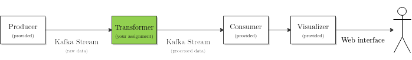

# Lab 3

`Workload: approx. 26 hours per student`
application. Spark, that we've used in the first two labs, is quite good at
processing large batches of data.

However, there is another class of big data applications that gather and
transform many tiny items coming from many so called *producers*, transform the
information, and send it off to many so called *consumers*, typically with a low
latency. Such applications are called *streaming* applications.

One example is when you're using a navigation service when driving a car. You're
producing location information about your car, this is streamed to a service
that collects this information from many other people as well. In turn it can
detect traffic jams. It gathers, transforms, and finally outputs traffic jam
information back to your phone, all in relative real time.

Since Apache Spark is more geared towards doing batch processing, for this lab
we will be using _Apache Kafka_; a well-known framework used a lot to create
such streaming applications in scalable fashion.

In typical streaming applications, we stream data into a pipeline that processes
the data by filtering and transforming it towards a desired result. At the end,
there is usually some form of visualization. Such a pipeline, that we will use
for this lab, is depicted in the figure below:

Your assignment will be to use Apache Kafka to transform a stream of raw data
into something more usable for our goal. Before explaining the exact goal, we
will first briefly go over the various components of the pipeline shown in the
figure.

### Kafka Stream
Kafka knows the concept of *streams* that have a specific *topic*. Producers and
consumers can subscribe to topics. Through the APIs of Kafka, we can pull and 
push data from and to such Kafka streams.

### Producer
The producer, contained in the `Producer` project creates (for the purpose of
this lab) randomly generated data records and outputs them on a Kafka stream
with the topic `events`.

For typical applications, this is some source like IOT devices, people's phones,
social media outputs, etc. Many services have streaming APIs, like e.g.
[Twitter](https://developer.twitter.com/en/docs/labs/sampled-stream/api-reference/get-tweets-stream-sample),
but for this lab, we just mimic a stream producing service, since that provides
a more learning-friendly environment.

The Producer will be provided, you don't have to do anything on the Producer.

### Transformer

The transformer consumes records from the Kafka stream of the topic `events`.
It produces a Kafka stream of the topic `updates`.
It therefore transforms 'events' to 'updates', where usually many events are
aggregated into some statistic, or filtered by some predicate.

Why this intermediate step? Why can't a consumer process the `events` itself?
For typical applications, this is usually not done by the consumer of the data
because the producers send so much data on the `events` topic, that e.g. a
simple phone or a laptop could not process it --- only a scalable application
run on a cluster could process so much information so quickly. This is the type
of framework that Kafka provides.

This is the component that you must implement.

### Consumer

The consumer finally acts as a _sink_, and will process the incoming updates
from the `updates` topic. It will do some final pre-processing before sending
the updates to the visualizer.

The Consumer will be provided, you don't have to do anything on the Consumer.

### Visualizer

The visualizer acts as a webserver, providing a webpage where you can view your
updates in a real-time fashion. Once it is up and running (see next page), you
can browse to it by using this link: [localhost:1234](http://localhost:1234).

### Further reading on Kafka

* [Kafka Intro](https://kafka.apache.org/intro)
* [Kafka Streams Architecture](https://kafka.apache.org/26/documentation/streams/architecture.html)
* [Kafka DSL API](https://kafka.apache.org/26/documentation/streams/developer-guide/dsl-api.html)
* [Kafka Processor API](https://kafka.apache.org/26/documentation/streams/developer-guide/processor-api.html)
* [Kafka KStream API docs](https://kafka.apache.org/26/javadoc/org/apache/kafka/streams/kstream/KStream.html)
* [Kafka Stream Examples](https://github.com/confluentinc/kafka-streams-examples)
* [JSON Serde support for Kafka](https://github.com/azhur/kafka-serde-scala)
* [Mastering Kafka Streams](https://jaceklaskowski.gitbooks.io/mastering-kafka-streams/)